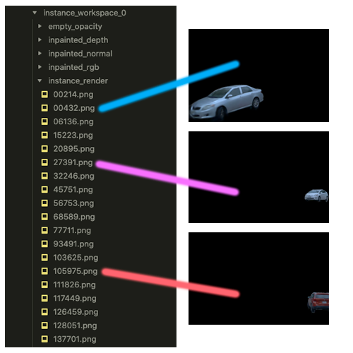

<p align="center">

  <h2 align="center">3D StreetUnveiler with Semantic-aware 2DGS - a simple baseline</h2>
  <h3 align="center">ICLR 2025</h3>
  <p align="center">
    <a href="https://davidxu-jj.github.io/"><strong>Jingwei Xu<sup>1</sup></strong></a>
    ·
    <a href="https://yikai-wang.github.io/"><strong>Yikai Wang<sup>2</sup></strong></a>
    ·
    <a href="https://scholar.google.com/citations?user=1UD_eBQAAAAJ&hl=en"><strong>Yiqun Zhao<sup>3,6</sup></strong></a>
    ·
    <a href="https://scholar.google.co.uk/citations?user=Vg54TcsAAAAJ&hl=en"><strong>Yanwei Fu<sup>5</sup></strong></a>
    ·
    <a href="https://scholar.google.com.sg/citations?user=fe-1v0MAAAAJ&hl=en"><strong>Shenghua Gao<sup>3,4</sup></strong></a>
    <br>
    <b>
        <sup>1</sup> ShanghaiTech University &nbsp;  
        <sup>2</sup> Nanyang Technological University &nbsp;
        <sup>3</sup> The University of Hong Kong <br>
        <sup>4</sup> HKU Shanghai Intelligent Computing Research Center &nbsp;  
        <sup>5</sup> Fudan University &nbsp;  
        <sup>6</sup> Transcengram
    </b>
    <br>
    <br>
        <a href="https://arxiv.org/abs/2405.18416"></a>
        <a href="https://streetunveiler.github.io/"></a>
    <br>
    </p>

  <table align="center">
    <tr>
    <td>
      
    </td>
    </tr>
  </table>

# Example

https://github.com/DavidXu-JJ/StreetUnveiler/assets/68705456/103cf1f1-5808-4b52-856c-e27634414749

# Data Preparation

```bash
# Run this command before get started.
git submodule update --init --recursive
```

Waymo: Please follow [this instruction](docs/waymo.md).

Pandaset: Please follow [this instruction](docs/pandaset.md).

Following datasets are not used in the paper, but we provide the instruction and code utilities/support for them:

Kitti: Please follow [this instruction](docs/kitti.md).

nuScenes: Please follow [this instruction](docs/nuscenes.md).

# Installation

```bash
conda create -n streetunveiler python=3.10
conda activate streetunveiler

# Suppose CUDA version is 12.1, please change your code properly according to your CUDA version.
conda install pytorch==2.5.1 torchvision==0.20.1 torchaudio==2.5.1 pytorch-cuda=12.1 -c pytorch -c nvidia

pip install -r requirements.txt

git submodule update --init --recursive
pip install submodules/superpose3d
pip install submodules/sh_encoder
pip install submodules/simple-knn
pip install submodules/diff-surfel-rasterization

cd submodules/tiny-cuda-nn/bindings/torch
pip install .

# For Pandaset
cd submodules/pandaset-devkit/python
pip install .
```

# Inpainting Pretrained Model Preparation

We build some modules to easily use inpainting model at `utils/zits_utils.py` and `utils/leftrefill_utils.py`. Please download the pretrained models and put them under the corresponding directories before use them.

## ZITS-PlusPlus

Under `./3rd_party/ZITS-PlusPlus`, please follow its official instruction to download the pretrained model.

Or you may download and extract the model from this backup [google drive link](https://drive.google.com/drive/folders/1MzJ5PeTr7yA4VMbvf6Qp1qQzdzCgESic?usp=sharing). And put them under `./3rd_party/ZITS-PlusPlus/ckpts`.

Or you may run the following command to download the model:

```bash
cd 3rd_party/ZITS-PlusPlus
mkdir ckpts
cd ckpts
wget https://huggingface.co/jingwei-xu-00/pretrained_backup_for_streetunveiler/resolve/main/ZITS%2B%2B/best_lsm_hawp.pth
wget https://huggingface.co/jingwei-xu-00/pretrained_backup_for_streetunveiler/blob/main/ZITS%2B%2B/model_512.zip
unzip model_512.zip
```

It should be like:

```
ZITS-PlusPlus
|-- ckpts
|   |-- best_lsm_hawp.pth
|   |-- model_512
|   |   |-- config.yml
|   |   |-- models
|   |   |   `-- last.ckpt
|   |   |-- samples
|   |   `-- validation
|   `-- model_512.zip
|
...
```

Finally, do:

```bash
cd 3rd_party/ZITS-PlusPlus/nms/cxx/src 
source build.sh
```

## LeftRefill

Under `./3rd_party/LeftRefill`, please follow its official instruction to download the pretrained model.

Or you may download the model from this backup [google drive link](https://drive.google.com/drive/folders/1BE61vYBTZ1pdz67QRxBMOcArRVXvqBRX?usp=sharing). And put them under `./3rd_party/LeftRefill/pretrained_models`.

Or you may run the following command to download the model:

```bash
cd 3rd_party/LeftRefill
mkdir pretrained_models
cd pretrained_models
wget https://huggingface.co/jingwei-xu-00/pretrained_backup_for_streetunveiler/resolve/main/LeftRefill/512-inpainting-ema.ckpt
```

It should be like:

```
LeftRefill
|-- pretrained_models
|   `-- 512-inpainting-ema.ckpt
|
...
```

# Run the code

Suppose your data is under `data/waymo` and is like:

```
data
`-- waymo
    |-- colmap
    |   |-- segment-10061305430875486848_1080_000_1100_000_with_camera_labels
    |   |-- segment-1172406780360799916_1660_000_1680_000_with_camera_labels
    |   |-- segment-14869732972903148657_2420_000_2440_000_with_camera_labels
    |   `-- segment-4058410353286511411_3980_000_4000_000_with_camera_labels
    |-- processed
    |   |-- segment-10061305430875486848_1080_000_1100_000_with_camera_labels
    |   |-- segment-1172406780360799916_1660_000_1680_000_with_camera_labels
    |   |-- segment-14869732972903148657_2420_000_2440_000_with_camera_labels
    |   `-- segment-4058410353286511411_3980_000_4000_000_with_camera_labels
```

## Stage 1: Reconstruction

```bash
# --source_path/-s: the path to the preprocessed data root, to read the lidars
# --colmap_path/-c: the path to the colmap processed data root, to read the SfM points
# --model_path/-m: the path to save the output model
# --resolution/-r: the scaling of input images' resolution

# Waymo
python3 train.py -s ./data/waymo/processed/segment-1172406780360799916_1660_000_1680_000_with_camera_labels \
                 -c ./data/waymo/colmap/segment-1172406780360799916_1660_000_1680_000_with_camera_labels \
                 -m ./output_waymo/segment-1172406780360799916_1660_000_1680_000_with_camera_labels \
                 -r 4
                 
# Pandaset
python3 train.py -s ./data/pandaset/raw \
                 -c ./data/pandaset/colmap/027 \
                 -m ./output_pandaset/027 \
                 -r 4
                 
# Kitti
python3 train.py -s ./data/kitti/raw \
                 -c ./data/kitti/colmap/2011_09_26/2011_09_26_drive_0001_sync \
                 -m ./output_kitti/2011_09_26_drive_0001_sync \
                 -r [proper_resolution_scaling]
                 
# nuScenes
python3 train.py -s ./data/nuscenes/raw \
                 -c ./data/nuscenes/colmap/scene-0001 \
                 -m ./output_nuscenes/scene-0001 \
                 -r [proper_resolution_scaling]
```

```
python3 render.py -m ./output_waymo/segment-1172406780360799916_1660_000_1680_000_with_camera_labels 
```

## Stage 2: The preparation for Unveiling

```bash
# Example: sh unveil_preprocess.sh [model_path] [gpu_id]
sh unveil_prepare.sh ./output_waymo/segment-1172406780360799916_1660_000_1680_000_with_camera_labels 0
```

After running `inpainting_pipeline/1_selection/1_instance_visualization.py`. There will be some visualizations under `model_path/instance_workspace_0/instance_render`. 



You can get the instance id through the filename of each image. And then select it as removed object when running `inpainting_pipeline/2_condition_preparation/1_select_instance.py` by setting `--instance_id`. (By default,  `--all` is set to removing all objects.)

## Stage 3: Unveiling

```bash
# Example: sh unveil.sh [model_path] [key_frame_list] [gpu_id]
sh unveil.sh ./output_waymo/segment-1172406780360799916_1660_000_1680_000_with_camera_labels "150 120 90 60 30 0" 0
```

`key_frame_list` is the list of key frames as is discussed in Section A.2 of our supplementary material. The selection of key frames will affect the performance of the unveiling and may differ for each scene.

# Evaluation

```bash
# Example: sh eval_lpips_fid.sh [results_path] [gt_path] [gpu_id]
model_path=...
sh eval_lpips_fid.sh "$model_path/instance_workspace_0/final_renders" "$model_path/instance_workspace_0/gt" 0
```

# Acknowledge

This project is built from [3DGS](https://github.com/graphdeco-inria/gaussian-splatting) and [2DGS](https://github.com/hbb1/2d-gaussian-splatting). The data preprocessing for waymo dataset is mainly based on [neuralsim](https://github.com/PJLab-ADG/neuralsim). The implementation of environment map is based on [nr3d](https://github.com/PJLab-ADG/nr3d_lib) and [torch-ngp](https://github.com/ashawkey/torch-ngp). The inpainting model is based on [LeftRefill](https://github.com/ewrfcas/LeftRefill) and [Zits++](https://github.com/ewrfcas/ZITS-PlusPlus). 

We appreciate the authors for their great work.

# Bibtex

```bibtex
@inproceedings{xu2025streetunveiler,
  author       = {Jingwei Xu and Yikai Wang and Yiqun Zhao and Yanwei Fu and Shenghua Gao},
  title        = {3D StreetUnveiler with Semantic-aware 2DGS - a simple baseline},
  booktitle    = {The International Conference on Learning Representations (ICLR)},
  year         = {2025},
}
```
